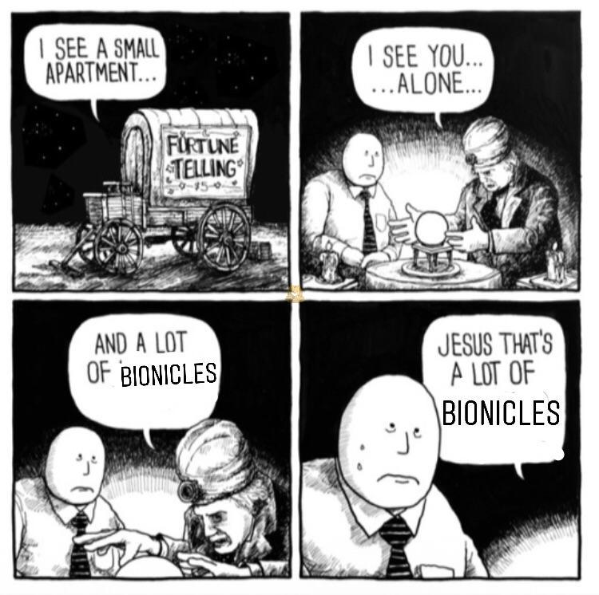
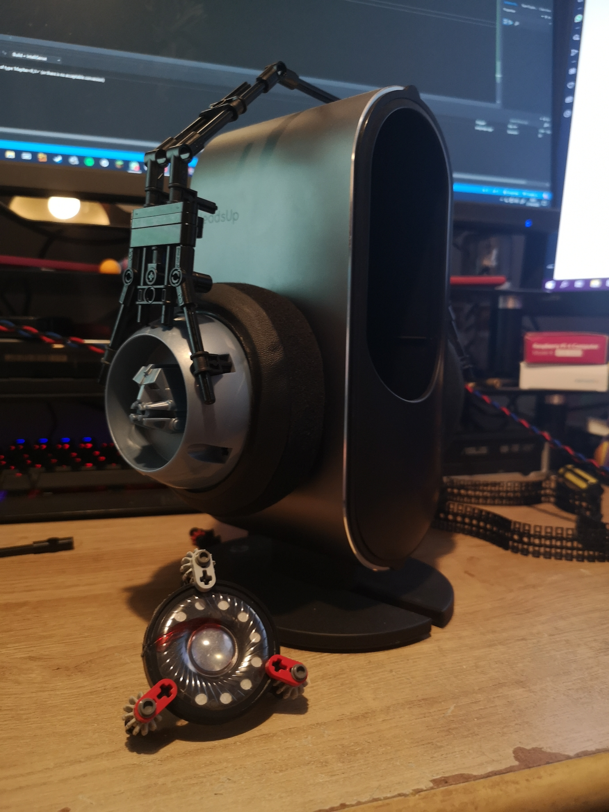

# Bionicle Headphones
- [Bionicle Headphones](#bionicle-headphones)
  - [Introduction](#introduction)
  - [Original Post](#original-post)
  - [Forethoughts](#forethoughts)
  - [Links](#links)
## Introduction

So, I had a spare set of gaming headphones lying around - they were broken, and I only had them to salvage for parts in the first place. I also have Lego. A lot of Lego. Like, a loooot of Lego. Take that image, and multiply it by seven.

So I figured I could use the drivers from these headphones and make something kinda unique. And it works! Everything except the drivers, cables, and earpads are made entirely of official Lego pieces.

## Original Post

Combine two hobbies with one creation? Can it be done? Maybe... Maybe. But it would be mad! Is it impossible?

It can't be... Surely? Someone would have to be a lunatic to even attempt making Bionicle Headphones, right?

Right. Which is exactly why I've taken it upon myself to do exactly that.

I present to you, the B01GE, what I am certain is the World's First fully functional Lego Bionicle Headphones.

The Bonkphone 1: Gali Edition is a 50ohm headphone and features 45mm neodymium drivers capable of reproducing the full frequency range, from 50hz to 20khz. Earpads are plush Dekoni velour wrapped around their famously high quality memory foam. Feeding into these is a pure OFC cable twisted with silver-plated copper, hand-braided with care, and terminated with a high quality Neutrik 3.5mm TRS.

Weighing in at just under 190 grams, and with an exceptionally low clamping force, these semi-open headphones will make for a pleasurable listening experience for hours on end. Carefully designed, this one-of-a-kind set of headphones sports handsome highlighted Left and Right indicators just above the earcups, and has the capability to be upgraded with a fully Technic "lohb strap", made from lightweight and flexible track segments.

How does it sound?

Mediocre. The sonic properties of a 20 year old plastic canister lid leave a lot to be desired, but I think I can tune it with some clay and wadding, although it won't ever be perfect I think I can make it better.

## Forethoughts

I plan on remaking these someday. Better drivers, better dampening. Changable headbands, because the Lego one isn't great. But conceptually, I dig this.

B02Xe when?

## Links

More pictures of this project are available in the [Drive folder](https://drive.google.com/open?id=1_f_YMx_V_4qDXu0V2l3mPHudoEcrZv9L)

[Reddit Thread](https://www.reddit.com/r/headphones/comments/g98cv7/i_may_have_built_some_working_bionicle_headphones)
