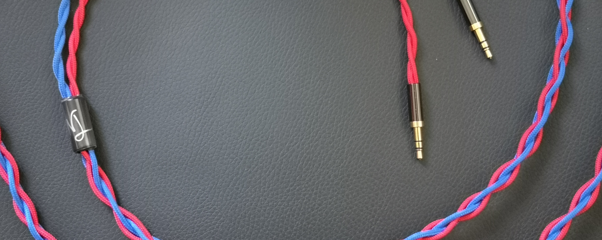
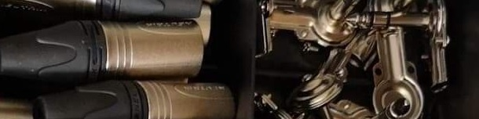
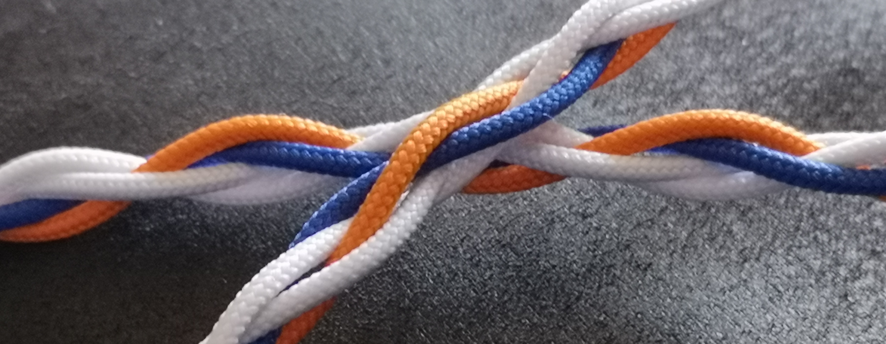

# nlovell audio cables

- [nlovell audio cables](#nlovell-audio-cables)
  - [About Me](#about-me)
  - [Cables](#cables)
    - [Connectors](#connectors)
    - [Ika Series](#ika-series)
    - [Kiore Series](#kiore-series)
    - [Manu Series](#manu-series)
    - [Tumuku Series](#tumuku-series)
  - [Returns and Warranty](#returns-and-warranty)
    - [Returns](#returns)
    - [Warranty](#warranty)
  - [Contact](#contact)
  - [Testimonials and Reviews](#testimonials-and-reviews)
  - [FAQ](#faq)
  - [Glossary](#glossary)

----

## About Me

I'm Alan, I'm a 21 year old university student. I've been tinkering with electrical projects for as long as I can remember, and have been soldering for over 10 years now. I've always had an interest in audio equipment, but visiting a HeadFi event in 2018 really sparked a passion for me. Since then, I've accumulated a few high-end and midrange headphones and have gotten stuck in with modding, repairing, and otherwise tinkering with portable audio equipment.


_More pictures available [here](https://drive.google.com/open?id=1TaY7_JfRnlylWYvRs6gfiyFJBXne6QWk)_

The audio game is already prohibitively expensive -  I'd rather keep things low-price and high-quality so the everyday audiophile can have a cable they love the look and feel of, rather than cater to those with more money than sense. So in 2020, I decided to make a cost-effective solution for those who want custom cables.

All my cables are hand-made in the UK, using legitimate quality parts sourced from UK and EU-based suppliers wherever possible.

----

## Cables

Right, here's the meat-and-potatoes of this page. _Cables_. The main difference between the series is the specific conductor used.

My pricing structure is simple; **A basic cost-per-metre for braided cables, plus the cost of connectors** (which vary significantly).

| Series                    | Application | Cost per Metre |
|---------------------------|-------------|----------------|
| [Ika](#ika-series)        | Headphones  | £12.00         |
| [Kiore](#kiore-series)    | Headphones  | £15.50         |
| [Manu](#manu-series)      | Speakers    | £12.00         |
| [Tumuku](#tumuku-series)  | Headphones  | £18.50         |

Note that the vast majority of my cables are unshielded, and are therefore unsuitable for instrument or microphone cables. I am however able to make appropriately shielded cables, but I really like braiding things. It's fun. All of my Y-splitting cables utilise a custom aluminium-shell Y-split.



I currently use Cardas Audio Quad Eutectic Solder when making my cables, if anyone cares. It's a blend of silver, copper, tin, and lead according to the [Cardas Audio website](http://www.cardas.com/solder.php).

I can ship internationally, and can provide quotes but if you want to figure out an estimate feel free to do so [here](https://www.royalmail.com/price-finder).

To help me offer an accurate quote, please fill out the following form:

``` none

Cable Request
Type:     [series]
Length:   [specify unit]
Source:   [amp end]
Sink:     [headphone end]
Colours:  [pick up to four]
Location: [country]

```

----

### Connectors

At some point, I'm going to list every connector I can get easily, and the general lead-time on availability.
The lead-time only applies to items I don't have to hand - as a student, I can't afford to keep hundreds of pounds worth of connectors immediately to hand, but I do try and keep the common ones readily available.



These are connectors I can easily get within a few days, typically less than a week.

``` none

3.5mm TS, 3.5mm TRS, 3.5mm TRRS, 2.5mm TS, 2.5mm TRRS, 6.35mm TRS, XLR 4, XLR 3, Mini XLR 4, Mini XLR 3, RCA, Banana

```

There are several other connectors that I *sometimes* have to hand, but if not, I can order from the UK at a higher rate. If you're willing to wait, I am happy to order these from overseas suppliers which can often be significantly cheaper.
The high-rate connectors are typically available in less than a week, but overseas may take significantly longer.

``` none

Pentaconn, Sennhesier HD6XX style, HD800 style

```

And then there's the ones I've yet to figure out how to get from the UK, so I'll likely have to order them from overseas.
These may take significantly longer.

``` none

HiRose (MrSpeakers), Fostex TH-900 style

```

### Ika Series

Ika are the entry-level cables made here. They're a hard-wearing sleeved cable and last a long time.  
This is what most people come here for, as they are optimised for price:performance. I tend to have a lot of this material to hand at any given time.



_Conductor material:_ Pure copper twisted with silver-plated strands.

| Specs for nerds    |                   |
|--------------------|-------------------|
|Conductors          | 7x  .08mm SPC OFC |
|                    | 32x .08mm OFC     |
|Insulation          | XLPCE             |
|Resistance          | .093 Ω/m          |
|Unsleeved core size | 1.6mm             |
|Sleeved core size   | 1.9mm             |

### Kiore Series

Kiore are a step-up from the Ika, but still firmly in the "affordable" range of prices.
Kiore is a little more flexible than Ika, which some may prefer.

_Conductor material:_ Pure copper.

| Specs for nerds    |                |
|--------------------|----------------|
|Conductors          | 20x .12mm OFC  |
|Insulation          | XLCPE          |
|Resistance          | .083Ω/m        |
|Unsleeved core size |                |
|Sleeved core size   |                |

### Manu Series

Manu is a side-step on the Kiore series. It's not much different in price, but it's a significantly heavier cable.

Cables made using Manu are not be as flexible as Kiore or Ika due to Manu cables due to significantly thicker gauge than the other two, so this option may not be suitable for all use-cases. This is what I use for speaker cables, as it's thick and heavy without being overbearing. It is available unsleeved in black, white, red and green; Manu cables can also be sleeved to make for that stylish flair between your power amplifier and your speakers.

_Conductor material:_ Pure copper.

| Specs for nerds    |                |
|--------------------|----------------|
|Conductors          | 30x .25mm OFC  |
|Insulation          | XLCPE          |
|Resistance          | .013Ω/m        |
|Unsleeved core size | 2.3mm          |
|Sleeved core size   | 2.6mm          |

### Tumuku Series

Tumuku is a fine braid stranded SCP copper, all made and assembled in England. PTFE insulation makes it softer than XLCPE, so this wire is better suited for IEMs. Available in various colours (unsleeved), and more various coloures (sleeved).

_Conductor material:_ Silver-plated copper.

| Specs for nerds    |                |
|--------------------|----------------|
|Conductors          | 19x .15mm SPC  |
|Insulation          | PTFE (Teflon)  |
|Resistance          | .058Ω/m        |
|Sleeved core size   |                |
|Unsleeved core size | 1.1mm          |

----

## Returns and Warranty

I may just be a guy doing this for fun, but it doesn't mean I'm a monster.

### Returns

My cables are made bespoke to your specifications. As such, returns *may* be accepted subject to fees approximately equivalent to the cost of the connectors + 10%. This cost will vary by cable, as if you no longer want it, I'll either have to absorb the cost of material personally or find another buyer.

As the cost will vary, please ask about the returns related to your specific configuration.

### Warranty

I will honour a 12 month warranty on any of my analogue cables, from the date provided on your certificate of authenticity.
Outside of this period, I will be willing to repair cables for a small fee.

----

## Contact

I mostly use email and Instagram.
Email - [Link](mailto:cables@nlovell.net)  
Instagram - [@nlovellaudiocables](https://instagram.com/nlovellaudiocables)

----

## Testimonials and Reviews

If anyone has given me a response when receiving my cables, I'll do my best to update this section and keep any reviews here.

Quote from Tim, owner of [Cable #5](https://drive.google.com/open?id=1DuVo1PUs0NMrvRNHjxNE47YNgnMcCtFh).  
Original post [here](https://www.facebook.com/groups/HeadphoneAmplifiers/permalink/3052179834841487/)
> **Custom cable by Alan Lovell.**  
> I managed to chance into this person on a post about cables. I was in the market for a custom cable for my Hifiman HE-4XX. After a few messages back and forth about what I was after, length, color, terminations and such. A painless PayPal was sent and I sat back and waited. I got regular updates on the build and status of my cable, which was super! When everything was finished up, verification of address and pics of finished cable were sent. Two weeks later I had this cable in my hands!  
> **First impression.**  
> Cable was packaged well. Included was a signed card with color choices, termination and such. Cable felt well built, everything was even. There were no uneven gaps or unsightly kinks when evened out. It was exactly what I wanted when I ordered. Not too stiff, but not too floppy either.  
> **Actual use.**  
> I plugged them into my 4XX, the 3.5mm ends attached with a satisfying click. The 3.5mm se plug attached to my nx3s with no fuss. I’m not a big believer in cables changing sound, ymmv. There were no cutouts or static or random noises when turning, twisting, or walking around.  
> **Verdict!**  
> I am extremely happy with my purchase. Cable is exactly what I wanted, affordable, and service was exceptional! Will definitely order again!  

----  

## FAQ

You got questions? I got answers.

**_What payment methods do you accept?_**  
Primarily, I use PayPal - however, I'm willing to make custom listings on eBay for that peace of mind. Unfortunately, eBay do charge fees to use, so this fee will be added onto the agreed price. Usually this is 10% of the total cost, which is why I don't like using eBay as it artificially inflates the cost of my products.

**_What can you make?_**  
Anything you want! I primarily deal with 4 and 3-core braids, but I can go higher, and can work with almost any kind of connectors. _USB?_ Done. _Mini-XLR?_ Cool. _Full-size XLR?_ Easy. _DMX?_ Yep.  
If you're willing to pay for the connectors, I'm willing to make cables for them.  
There are some cables that might not be best suited to be braided, which I will advise on, but if you care more for appearance than performance who am I to stop you?

**_How many have you made?_**  
Enough. I've soldered several dozen cables, and have been building a portfolio of my braided cable works since 2020. Said gallery can be found [here](https://drive.google.com/open?id=1TaY7_JfRnlylWYvRs6gfiyFJBXne6QWk). Inside you'll find examples of braiding, finished cables, and close-up photos of my soldering work.

**_What material do you use?_**  
I personally focus on price:performance, so my conductor and connector choices are usually what people would call "midrange". Refer to the _Specs for Nerds_ tables relating to specific [cables](#cables) for more details. But if you're willing to pay for more expensive materials, I'm more than happy to work with them.

**_Where do you buy your materials?_**  
Wherever possible, I use UK and European suppliers and brands - however this isn't always possible, thanks to obscure connectors that are an absolute pain to get in the UK (4.4mm is one such example).

**_What's in the box?_**  
Well, typically my cables aren't boxed, but I get the gist of the question.  
Most of my cables are shipped in a bubble mailer pouch, and inside that they're kept safe and dry inside another zip-lock style bag. All my cables are provided with a velcro-style cable tidy, and a unique numbered Certificate of Authenticity which is logged with photographs on my Google Drive.

**_My series has something weird next to it! What does it mean?_**  
Typically the series will just be the name of the conductor used, be that Ika, Kiore, Tumuku, or any of the rest. If they're standard cables, then you'll just see the name. If there's any deviation, refer to this table. All the examples below use Ika, but the principle applies to any cables.

|Series | Meaning |
|-|-|
| Ika | Stock Ika configuration |
| Ika 3 | Ika made with a non-standard number of cores, eg 3 (instead of 4) |
| Ika - Tahu | Part of the _inspired by_ range; a dash followed by another word means that this cable has a distinct theme |
| Ika U | Typically my cables are sleeved and braided - the U denotes they are unsleeved |
| Ika B | The B stands for Bundle, and means that they're sleeved, but unbraided |

These modifiers may be used in conjunction with one another - for example, there may be an _Ika 3B - Tahu_ cable. This one would be a Tahu-themed cable with 3 bundled (non-braided) cores.

----

## Glossary

Want to know what something means? Here's a list of acronyms and terms I've used here. Individual's nomenclature may vary, so this is specifically what I mean.

| Term  | Meaning                   |
|-------|---------------------------|
| OFC   | Oxygen Free Copper        |
| SPC   | Silver-Plated Copper      |
| XLPCE | Cross-linked polyethylene |
| Braided | Weaving multiple strands together |
| Sleeved | Covered in a cloth outer |
| Bundled | Multiple strands in a single non-braided "bundle" |
