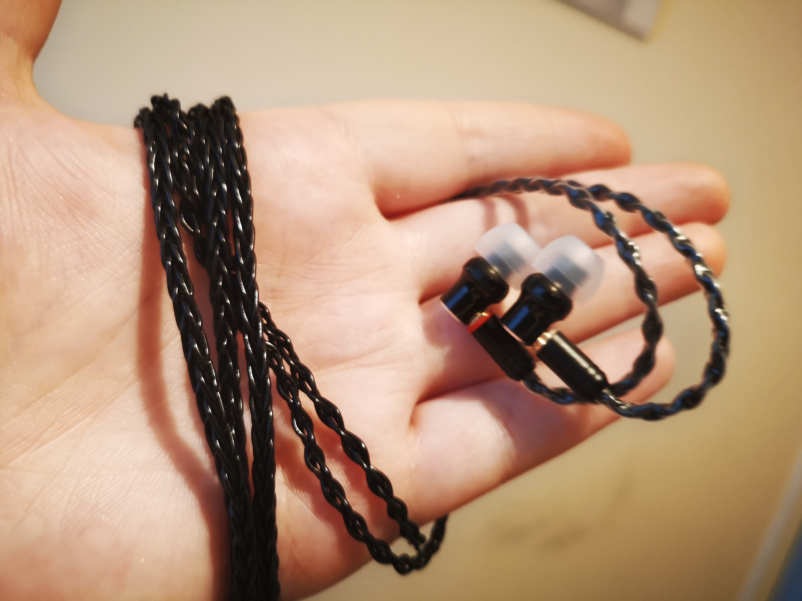

# DIY Audio

This repository is a way of me documenting my various audio-related projects. I've included a few of my favourite photos in this repo, but the bulk of the images are stored in Google Drive - refer to that for more details.

## Drive Link

Google Drive link for full photo albums:
[Root Drive](https://drive.google.com/drive/folders/1Lyp3fLHuOwGKH3idmnZFNgjnZCr9MF5w?usp=sharing)

## Custom Cables

I've been making a few - these are hand-braided cables made primarily from Van Damme cable and paracord sleeving.

More pictures available in the [Drive folder](https://drive.google.com/open?id=1TaY7_JfRnlylWYvRs6gfiyFJBXne6QWk)

## IEM Repairs

The Hifiman RE-600 are notorious for having a bad cable. I fixed this by replacing it with an MMCX connector.

More pictures available in the [Drive folder](https://drive.google.com/open?id=1XbSy0WUIIsLAM2sWpfWrpjCcsgIALzT1).

## Switch box

## DIY headphones

Alpha Dogs? Hell yeah. Full writeup coming soon.

## LEGO headphones

I'm not going to explain this here. Full writeup coming soon.